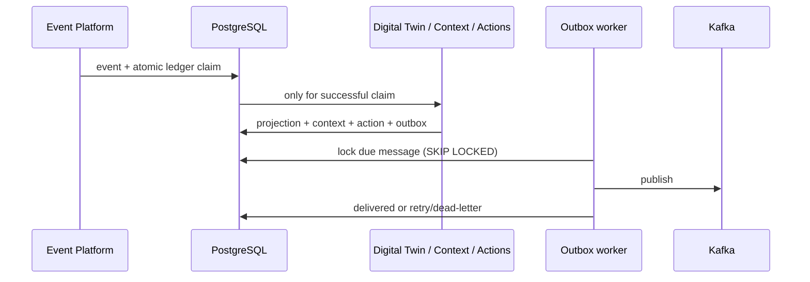

# Phase 3 production readiness

## Reliability architecture

The ingestion transaction persists the source event, atomically claims `(source, external_event_id)` in `processed_events`, updates the Digital Twin, builds a Context, generates Actions, and writes outbound envelopes to `outbox_messages`. The outbox worker separately publishes due envelopes; failures receive exponential backoff and eventually become `DEAD_LETTERED`.

## Idempotency and concurrency

The PostgreSQL unique constraint on the ledger is the processing claim, implemented with `INSERT ... ON CONFLICT DO NOTHING`. A duplicate can return the already stored event but cannot run projections or create new outbox rows. Twin writes use compare-and-swap version columns; a failed compare raises a concurrency error rather than overwriting data.

## Operations

`GET /metrics` exposes Prometheus counters, histograms, and outbox gauges. `GET /liveness` confirms the process is serving. `GET /health` and `GET /readiness` check PostgreSQL, Kafka, outbox-worker state, and replay initialization; readiness returns 503 when any dependency is unavailable.

Replay orders by `(timestamp, event_id)`, supports timestamp and event-id cutoffs, resets plant projections for full rebuilds, and intentionally bypasses the historical ledger so projection rebuilding is deterministic. Deploy PostgreSQL before the API, run `alembic upgrade head`, then start Kafka and the API. Monitor dead letters, retry backlog, duplicate rate, and version conflicts.

## Production readiness report

Completed: transactional outbox model/worker, database-backed idempotency, optimistic locking, audit model, replay service, Prometheus endpoint, health/readiness endpoints, and Alembic Phase 3 migration.

Partially implemented: replay has a service-level API only; an operational asynchronous job API is deferred. Kafka publication remains at-least-once, so downstream consumers must also deduplicate.

Coverage: existing unit/API tests cover ingestion, twin/context/action behavior, validation, repository behavior, and Kafka publishing. Add a PostgreSQL/Kafka integration environment before release to exercise real `ON CONFLICT`, lock contention, worker crash recovery, and full replay comparisons.

Assessment (1–10): replay 7, idempotency 8, concurrency 7, observability 7, recovery 7, traceability 7, auditability 6. Remaining risks are lack of deployed-infrastructure integration tests, no replay job control plane, and no downstream Kafka idempotency proof. Do not yet approve the platform as the foundation for Knowledge Graph or AI multi-agent workloads until those integration tests and operational replay controls are added.
